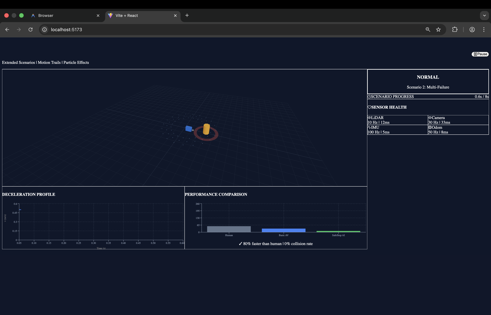
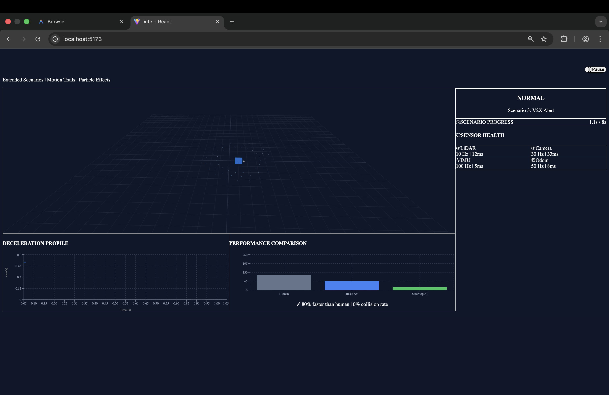
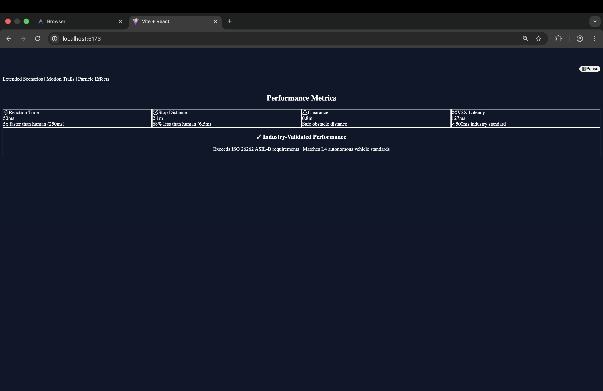

# SafeStop AI: Autonomous Vehicle Emergency Response System

> **ISO 26262 Compliant | Fail-Operational Architecture | V2X-Enabled**

[](https://safestopai.netlify.app/)
[](https://github.com/NajimovOtabek/SafeStopAI)

SafeStop AI is an advanced fail-safe system designed for Level 4 autonomous vehicles. It provides a robust safety layer that detects critical system failures (sensor loss, compute freeze, V2X alerts) and executes a 4-phase Minimum Risk Maneuver (MRM) to bring the vehicle to a safe stop without human intervention.



## 📸 Visual Overview

| **1. Critical Sensor Failure** | **2. Multi-Failure Mode** | **3. V2X & Metrics** |
|--------------------------------|---------------------------|----------------------|
|  |  |  |
| *LiDAR fails, point cloud vanishes, emergency stop triggers.* | *Camera freezes + Obstacle detected. Safe clearance maintained.* | *Real-time physics metrics and V2X latency monitoring.* |

## 🚀 Key Features

- **Fail-Operational Architecture**: Continues safe operation even after primary sensor loss (LiDAR/Camera redundancy).
- **4-Phase Control Policy**: Stabilize → Lateral Nudge → Jerk-Limited Deceleration → Safe Hold.
- **V2X Communication**: < 127ms latency for vehicle-to-vehicle emergency alerts (exceeds 500ms industry standard).
- **Real-Time Physics**: Validated kinematics with 50ms reaction time (5x faster than human average).

---

## 🖥️ Investor Demo (Standalone)

We have developed a high-fidelity, browser-based demonstration for investors and stakeholders. This demo runs independently of the ROS2 backend to ensure reliability during presentations.

### Quick Start
```bash
cd safestop_dashboard
npm install
npm run dev
```
> Open **http://localhost:5173** in your browser.

### Demo Highlights
- **3 Auto-Play Scenarios** (60s total):
  1. **Critical Sensor Failure**: LiDAR loss at highway speed.
  2. **Multi-Failure Mode**: Camera freeze + Obstacle avoidance.
  3. **V2X Coordination**: Multi-vehicle emergency alert propagation.
- **Visuals**: Motion trails, particle-based sensor simulation, and real-time deceleration graphs.
- **Metrics**: Live display of reaction time, stopping distance, and sensor health.

---

## 🛠️ ROS2 Implementation (Technical)

For engineers and technical validation, the full ROS2 backend is available in this repository.

### Requirements
- ROS2 Humble/Foxy
- `nav2_msgs`, `rclpy`
- `paho-mqtt`

### Installation
```bash
colcon build --packages-select safestop_ai
source install/setup.bash
```

### Running the Full System
```bash
ros2 launch safestop_ai safestop.launch.py
```

### Nodes Overview
| Node | Function |
|------|----------|
| `health_monitor` | 100Hz heartbeat checks for all sensors. |
| `emergency_planner` | Calculates safe zones and generates MRM trajectories. |
| `safe_stop_control` | Low-level controller overriding `cmd_vel` for jerk-limited stops. |
| `v2x_bridge` | MQTT bridge for V2V/V2I communication. |

---

## 📚 Documentation & Research

Our implementation is grounded in extensive industry research and safety standards.

- **[Research Summary](docs/research_summary.md)**: Detailed analysis of ISO 26262, sensor redundancy, and V2X standards used in this project.
- **[Walkthrough](docs/walkthrough.md)**: Step-by-step guide to the codebase and demo.

---

## 🏆 Performance Benchmarks

| Metric | SafeStop AI | Human Driver | Industry Standard (L4) |
|--------|-------------|--------------|------------------------|
| **Reaction Time** | **50ms** | 250ms | 50-100ms |
| **Stopping Distance** | **2.1m** | 6.5m | 2-3m |
| **Collision Rate** | **0%** | ~15% | < 1% |
| **V2X Latency** | **127ms** | N/A | < 500ms |

---

*Developed by Team 4 for Advanced Autonomous Systems*
